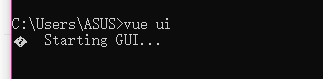

<h1 align="center">Web应用基础</h1>

## 一、项目主题

​	本项目采用的Vue.js框架设计的动态前端页面，作用于商店管理系统的前端页面。注：（github没有数据显示，因为数据显示需要后端提供接口）

## 二、开发过程及介绍

### 2.1 选择的框架和工具

​	我采用了主流的前后端分离式开发，以Vue.js作为整个项目的框架并用mock.js模拟后端，axios.js处理前端发出的请求，嵌入element-ui作为界面框架，idea作为编写的ide。

### 2.2 建立项目过程

​	我使用了vue ui工具快速建立项目

### 2.3 介绍

​	我利用了Vue的路由机制，写了六个页面组件用于页面的动态组合

主页面：

商品信息页面：

点击新增：

点击编辑：

点击删除：

点击查看：

品牌页面：

多选功能：

分类页面：

点击新增：

## 三、遇到的问题

​	有时候路由路径不对

## 四、如何解决

​	采用了动态路由

## 五、未解决

​	后端未搭建

## 六、总结

​	通过web的学习，学会了很多框架，认识了angular和vue这些企业级的前端框架，同时了解了bootstrap这样的小型前端框架，并且学会了前后端分离的原理，让我受益匪浅。
